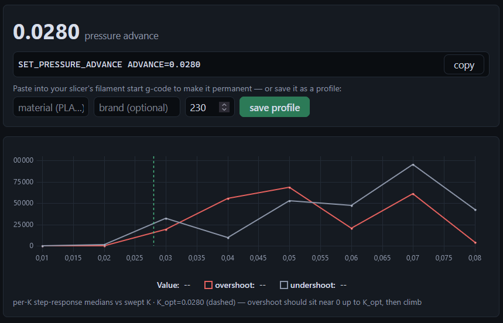
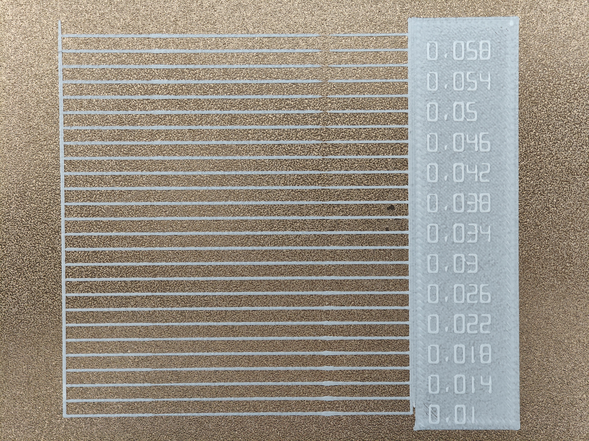

# QidiAutoPA compatibility
QidiAutoPA is a fairly simple shim that aims to make [autopa](https://github.com/G0BL1N/autopa) work on the Qidi Q2.

## Performance
Even though the CS1237 can reach up to 1280Hz, Qidi doesn't expose any way to get real streamed data; therefore the most we can reach is about 100-120Hz because we have to use an alternative way. This is a bit low for autopa, but it works.

Now for quality:
On my personal machine using Elegoo Rapid PLA+ at 230°C:
autopa (2026/10/04) gave a PA of 0.028 on Sweep mode and 0.024 on Decay experimental mode.


This is the PA calibration test I ran right after:


## Installing
*I highly recommend logging in as 'qidi' (password: qiditech) and not 'mks'*, otherwise you *will* get file permission/ownership errors.

1. Install autopa as normal.

2. Assuming your klipper install is at your home:
```bash
git pull https://github.com/Unii93/QidiAutoPA.git
cd QidiAutoPA
cp load_cell.py ~/klipper/klippy/extras/load_cell.py
cp qidi_load_cell.cfg ~/printer_data/config/qidi_load_cell.cfg
```

3. In `printer.cfg`, **above** the `#*# <---------------------- SAVE_CONFIG ---------------------->` marker, add `[include qidi_load_cell.cfg]`

4. Then either power cycle your printer or run `sudo systemctl restart klipper` to fully restart klipper. Standard RESTART or FIRMWARE_RESTART won't work as they don't restart the klippy extras.  

5. You're done.  
(head to `http://IP/autopa` if you installed autopa with the web interface)

6. Verify it works (optional)
Run `LOAD_CELL_DEBUG`, if you see 'sensor: found' and a non zero 'raw now', it works.

## Debug commands
If you don't plan on actively contributing to this project, you don't need these commands.
- LOAD_CELL_DEBUG: Debug read of the load cell (path, sample count, value range, actual sps)
- LOAD_CELL_TARE: Force Tare
- LOAD_CELL_PROBE_STREAM: Debug read of the load cell but stream

## How it works

Qidi's CS1237 driver is a proprietary compiled Cython module, meaning everything done here is technically guess work.  

The base functionement is to register a `[load_cell]` that autopa can use and bridge it to Qidi's driver.

- autopa's UI charts live force work with Moonraker's `load_cell/dump_force` websocket  
-> sent as `{'data': [[time_s, grams, counts, tare], ...], 'errors': N}`
- Qidi does **not** expose a way to obtain a bulk stream (or I couldn't make it work) even though the binaries show proof of plans for a bulk stream. Instead we have to spam one shot reads (the same thing Qidi's `WEIGHTING_DEBUG_QUERY` command does), this is the main reason why we are limited to around ~100 sps and not the 1280Hz the sensor could reach.


| autopa needs | shim provides |
|---|---|
| `lc.name` | config section name |
| `lc.sensor.get_samples_per_second()` | configured rate |
| `lc.get_collector()` | collector object |
| `.start_collecting(min_time=t0)` | subscribes to probe_air's bulk stream, (re)tares |
| `.collect_until(t_end)` | pumps reactor, returns `(rows, errors)` |
| `.is_started` (settable) | autopa uses this to release the collector |

`rows` are the 4-column `[time_s, grams, counts, tare]` records autopa expects;
autopa computes force as `-(counts - tare)`.